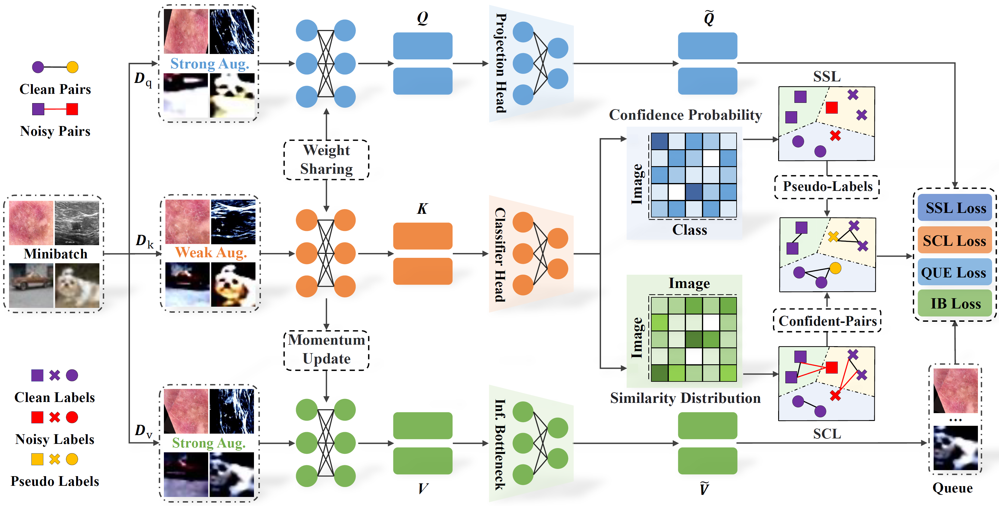

# Combating Medical Label Noise via Robust Semi-supervised Contrastive Learning (MICCAI 2023)




### Running the code:


### Requirements:
* Python 3.7.13
* Pytorch 1.12.1 
* Numpy 1.21.6
* cudatoolkit 11.7
* cudnn 8.5.0

### Please consider citing the following paper if you find this work useful for your research.

```

```


# SSCL
# SSCL
